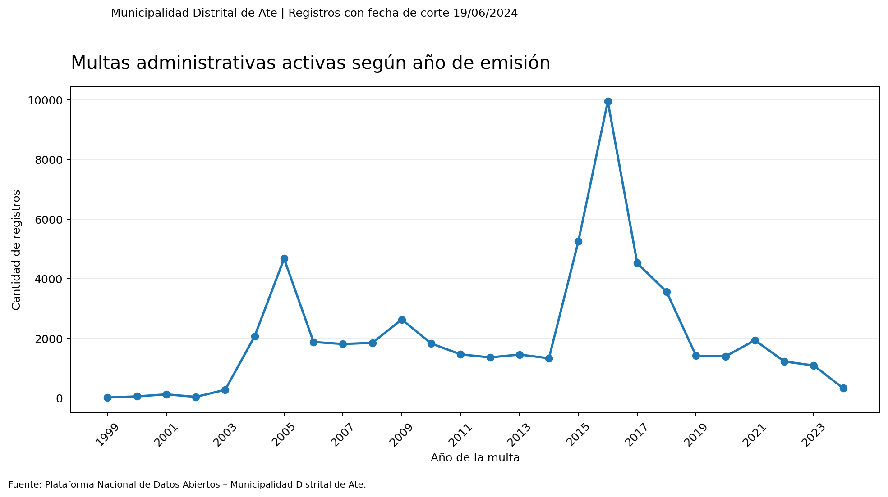
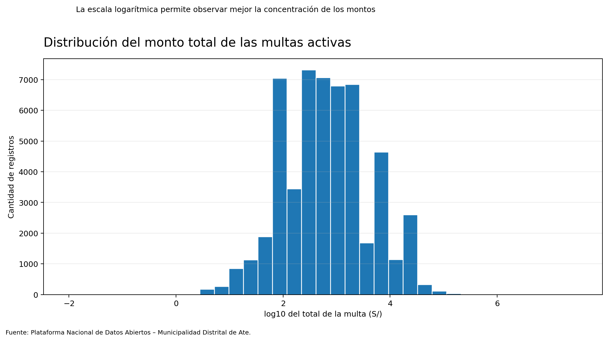
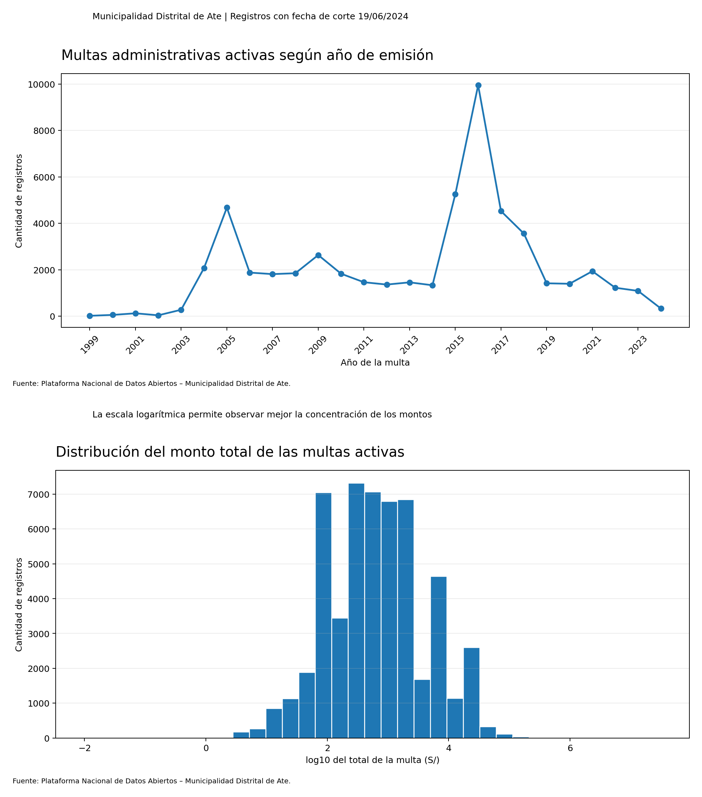
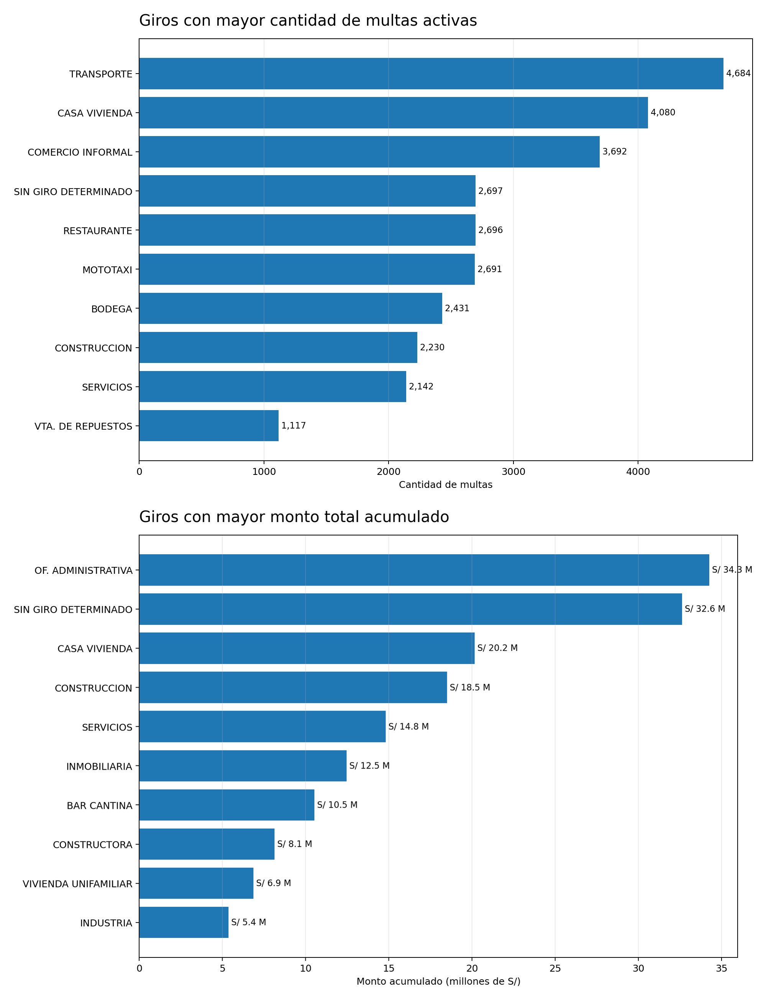

# Proyecto final de RStudio

## Análisis exploratorio de multas administrativas activas de Ate

**Estudiante:** Fernando Ramos  
**Herramienta:** RStudio  
**Fuente oficial:** Municipalidad Distrital de Ate - Plataforma Nacional de Datos Abiertos

## 1. Contexto del conjunto de datos

La base utilizada se denomina **“Multas administrativas activas de la Municipalidad Distrital de Ate – MDA”**. El conjunto fue publicado por la Municipalidad Distrital de Ate en la Plataforma Nacional de Datos Abiertos.

El objetivo de la base es mostrar las multas administrativas activas registradas en el sistema de recaudación municipal. El archivo contiene información sobre el año y fecha de la multa, zona, estado, giro, código y descripción de la infracción, monto, intereses, gastos, costas, descuentos y total.

Fuente del conjunto de datos:

https://www.datosabiertos.gob.pe/dataset/multas-administrativas-activas-de-la-municipalidad-distrital-de-ate-%E2%80%93-mda

## 2. Estructura del proyecto

```text
Proyecto_Final_Multas_Ate/
├── data/
│   ├── multas_ate_original.csv
│   └── multas_ate_limpia.rds
├── figures/
│   ├── grafico_multas_anio.png
│   ├── grafico_distribucion_total.png
│   ├── collage_graficos.png
│   └── grafico_analisis_final.png
├── scripts/
│   ├── EDA.R
│   └── 04_analisis_final.R
└── README.md
```

## 3. Importación, limpieza y preparación

La base original fue importada con `read_csv()`. Todas las columnas fueron leídas inicialmente como texto para conservar correctamente los códigos que tienen ceros a la izquierda.

Las principales transformaciones realizadas fueron:

- cambio de nombres de variables a minúsculas;
- eliminación de espacios vacíos;
- conversión de las fechas al formato fecha;
- conversión de las variables monetarias a numéricas;
- reemplazo de los valores vacíos de intereses, gastos, costas y descuentos por cero;
- eliminación de 2 filas exactamente duplicadas;
- creación de las variables `deuda_bruta` y `tiene_descuento`;
- guardado de la base limpia en formato RDS.

Después de la limpieza, la base contiene **53,504 observaciones y 25 variables**.

## 4. Estadísticas descriptivas

El monto total acumulado de los registros analizados es de **S/ 240,362,646.18**. El promedio por registro es de **S/ 4,492.42**, mientras que la mediana es de **S/ 592.50**.

La diferencia entre el promedio y la mediana indica que existen algunas multas con montos muy elevados que aumentan el promedio general.

El año con mayor cantidad de multas activas en la base es **2016**, con **9,950 registros**.

## 5. Visualización de datos

### Cantidad de multas por año



### Distribución del monto total



### Collage de gráficos



## 6. Pregunta de análisis

**¿Los giros con mayor cantidad de multas son también los que concentran el mayor monto total acumulado?**

Para responder la pregunta se agruparon los registros según el giro. Luego se calculó la cantidad de multas, el monto total, el promedio y la mediana para cada grupo.



## 7. Principales resultados

El giro **TRANSPORTE** presenta la mayor cantidad de multas, con **4,684 registros**. Sin embargo, su monto acumulado es de aproximadamente **S/ 2,691,465.98**, por lo que no ocupa el primer lugar por monto.

El mayor monto total corresponde al giro **OF. ADMINISTRATIVA**, con **S/ 34,257,793.02** distribuidos en **460 registros**. El segundo lugar corresponde a **SIN GIRO DETERMINADO**, con **S/ 32,630,738.64**.

Los diez giros con mayor monto acumulado concentran aproximadamente el **68.11%** del monto total de la base.

## 8. Conclusiones

La cantidad de multas y el monto acumulado muestran resultados diferentes. Tener una gran cantidad de registros no significa necesariamente que un giro concentre la mayor deuda.

Los resultados muestran que algunos giros con una cantidad menor de multas presentan montos acumulados muy altos. Esto ocurre porque existen registros individuales con valores considerablemente superiores a la mayoría.

Por esta razón, para analizar las multas administrativas no es suficiente observar solamente la frecuencia. También es necesario revisar el monto total, el promedio y la mediana de cada grupo.


